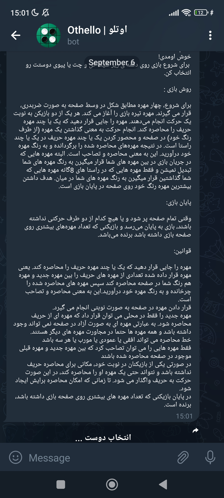
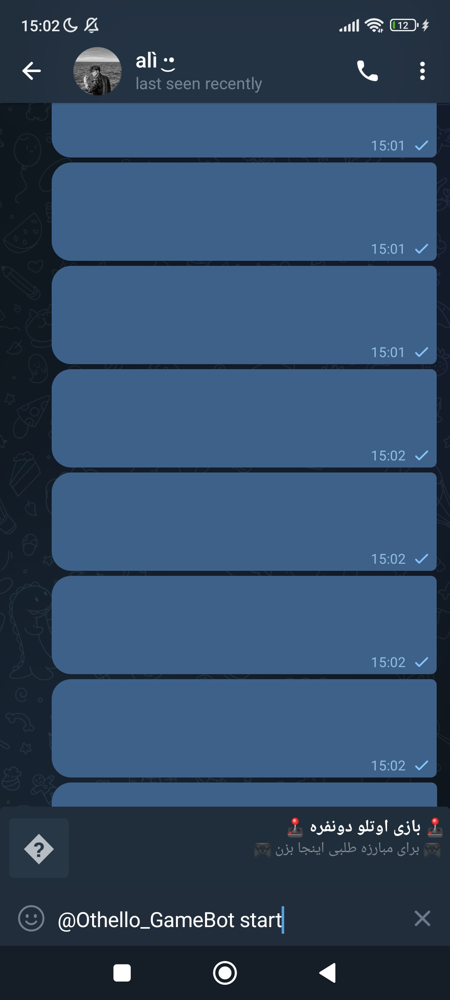
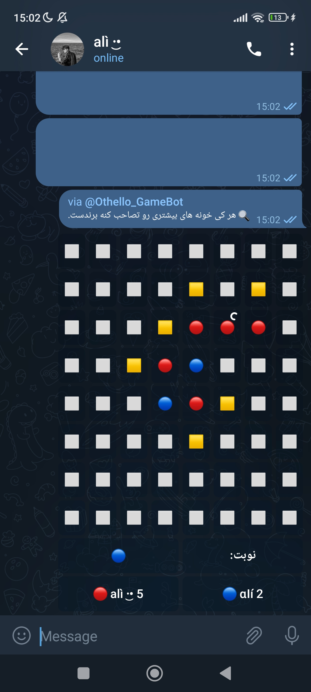
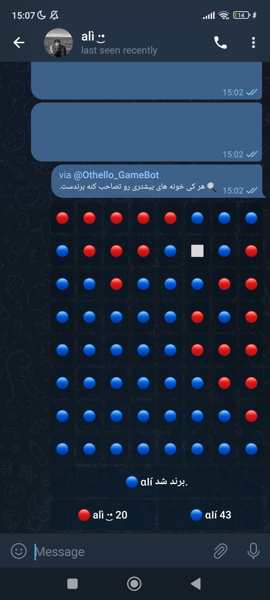

# 🎮 Othello Game Bot 🎮

_Telegram bot to play otehllo game with your firends in private or public chats, which is made by pyrogram library._

<br>

# Starting 🚀

_These instructions allow you to get a copy of the running project on your local machine._

## Pre-requisites 📋
_You need to have a 3.X version of Python_

## Installation 🔧

- Make a git clone or download it in zip
```bash
git clone https://github.com/irania9O/OthelloGmae-Bot.git
```
- Get in the directory
- Install from your terminal with pip requirements.txt:

```bash
pip install -r requirements.txt
```

- Edit `.env-sample` and rename to `.env`.

<br>

# Run the main 🧮:

```bash
python main.py
```
<br>

# Screenshots
<p float="left">
  
   
</p>
<p float="left">
  
   
</p>
